## Keras implementation of CycleGAN
Implementation using a tensorflow backend. Testing and evaluation done on
street view images.

### Results - 256x256 pixel images

#### Day 2 night
<table>
  <tr>
    <th>Input</th>
    <th>Translation</th>
    <th>Input</th>
    <th>Translation</th>
  </tr>
  <tr>
    <td>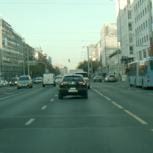</td>
    <td>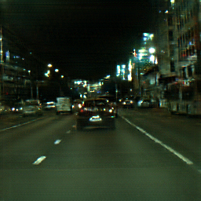</td>
    <td>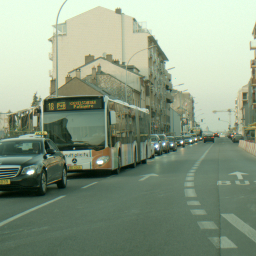</td>
    <td></td>
  </tr>
  <tr>
    <td>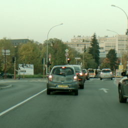</td>
    <td>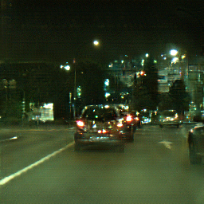</td>
    <td>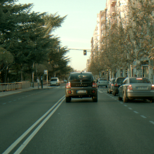</td>
    <td>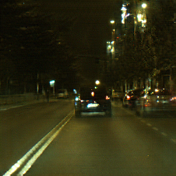</td>
  </tr>
</table>

#### Night 2 day
<table>
  <tr>
    <th>Input</th>
    <th>Translation</th>
    <th>Input</th>
    <th>Translation</th>
  </tr>
  <tr>
    <td>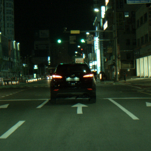</td>
    <td>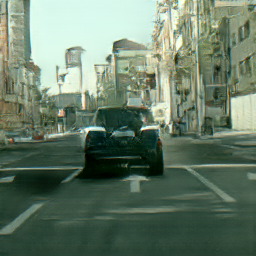</td>
    <td>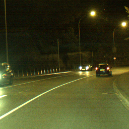</td>
    <td>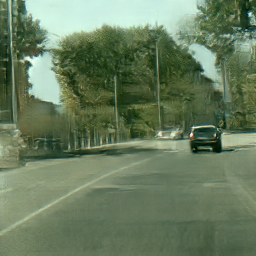</td>
  </tr>
  <tr>
    <td>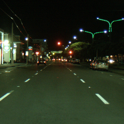</td>
    <td>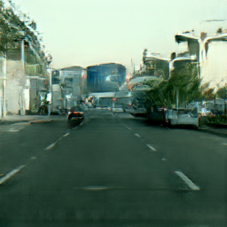</td>
    <td>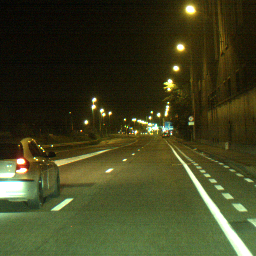</td>
    <td>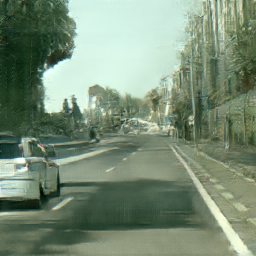</td>
  </tr>
</table>

### Model additions as training options
* Identity learning (on different modulus of training iterations)
* PatchGAN in discriminators
* Multi-scale discriminators
* Resize convolution in generators
* Supervised learning with training weight
* Data generator (if using a large dataset)
* Weight on discriminator training labels on real images

---

### Code usage  
1. Prepare your dataset under the directory 'data' and set dataset name to
parameter 'image_folder' in CycleGAN init function.
  * Directory structure on new dataset needed for training and testing:
    * data/Dataset-name/trainA
    * data/Dataset-name/trainB
    * data/Dataset-name/testA
    * data/Dataset-name/testB  

2. Set wanted training options, also found in the init function.

3. Train a model by:
```
python CycleGAN.py
```

4. Generate synthetic images by following specifications under:
  * generate_images/ReadMe.rtf

The following gif shows an example of the training
progression in a translation from day to night.

**Left:** Input image. **Middle:** Translated images. **Right:** Reconstructed images.


---

### More results

#### Day 2 night - gif


#### Rainy 2 sunny - gif


#### Sunny 2 rainy - gif

